# Welcome to KikuKey!

Hi! Welcome to KikuKey, a new Japanese Immersion platform to held guide you through Immersion and bring all the existing tools into easy to find place! KikuKey provides it users with all the guides and tools they need to begin learning Japanese through Immersion. Immersion has become a very popular language learning method in recent years and there is many tools to enhance your immersion experience. As someone learning Japanese, I found the amount of tools out there for learning very overwhelming so I decided to build KikuKey which brings all these tools to one easy to access place! So if your just beginning Japanese or immediate to advanced there is a place for you on KikuKey! Our automated immersion time trackers, video player and Epub/HTML reader make it easy to have all your immersion tools in one place! Enjoy!

# Features

## Guides to Japanese Immersion Tools

On KikuKey, we have many guides to help you get started with Immersion. We detailed how immersion works, setting up pop-up dictionaries, OCRing Manga and much more. I hope these guides aid you in your journey and make it as easy as possible to start!

## Video Player

The video player offers users a customization video experience for users. Users have two options for videos, either uploading local files or YouTube videos. For local files, you can upload your local video files and subtitles files to the player. In the player you get many customization's such as custom subtitles appearances and video behaviour (auto-pause on subtitles, hover pause etc), even map-able key binds! You can also connect to Anki (Flashcard system) to make custom cards from the subtitles to study later! We have a guide to the video player on the site! The video player is built using VideoJS and React!

## Manga/EPUB Reader

The manga/EPUB reader is the perfect place for users to upload their local EPUB's and manga files! Users can upload their files, they are then stored in the library via browser storage so you can come back to where you left off! using EpubJS and Mokuro, we have been able to enable select-able text in these readers to allow for pop-dictionary support! There is also customization such a text size, background color etc. The reader is the perfect place to store your books to read all in one place!

## Hiragana & Katakana Quizzes/Charts

To help the users just beginning, the hiragana and katakana quizzes alongside the charts are a great tool to teach beginners the basics of the Japanese writing system! 

## Automated Immersion Tracking Time

KikuKey features automated immersion tracking time. This means anytime your watching or reader the time you've spent is being logged for you to see on your dashboard to view your progress! On the dashboard you can see different views for your daily, weekly , monthly and yearly immersion session and total hours, you can also set goals for those time periods and they will be automatically tracked! This helps users see the progress they are making and how much time they spent learning!

# Images

## Home 
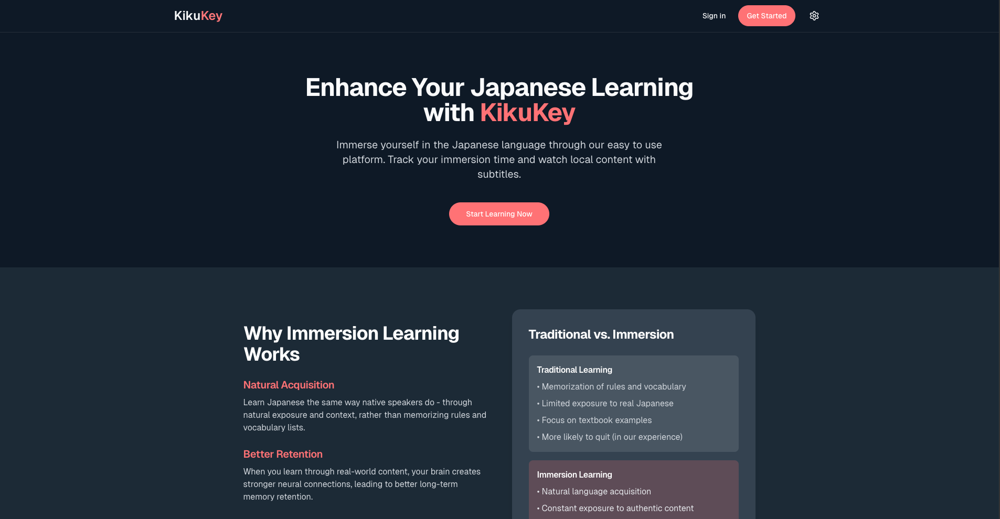

## Dashboard
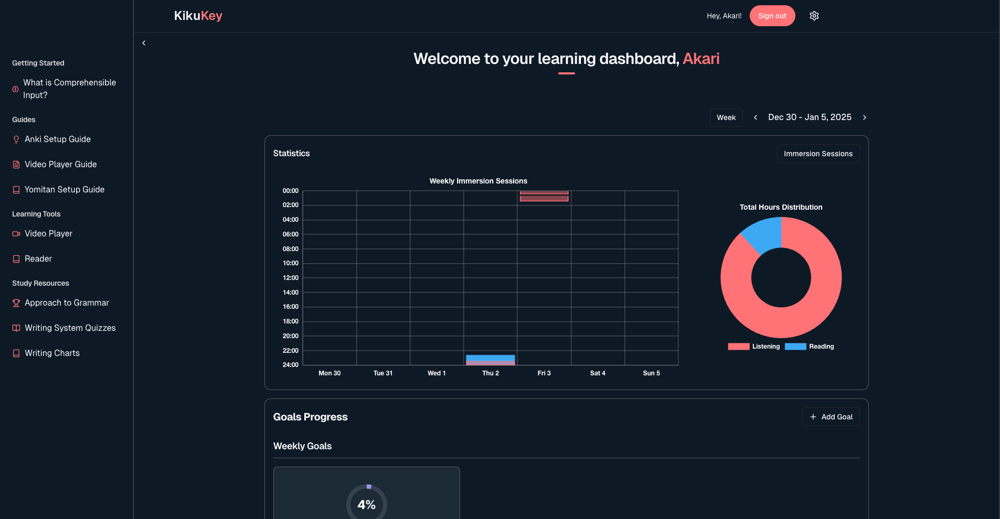

## Video Player
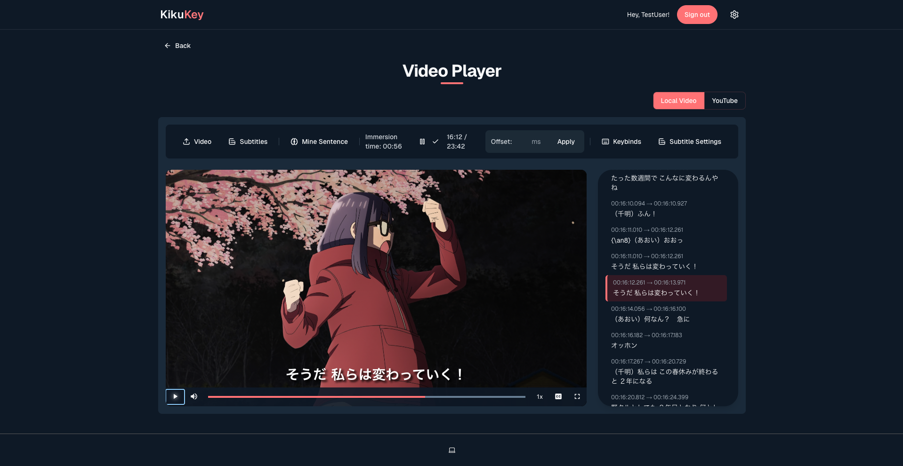

## Epub/Manga Reader
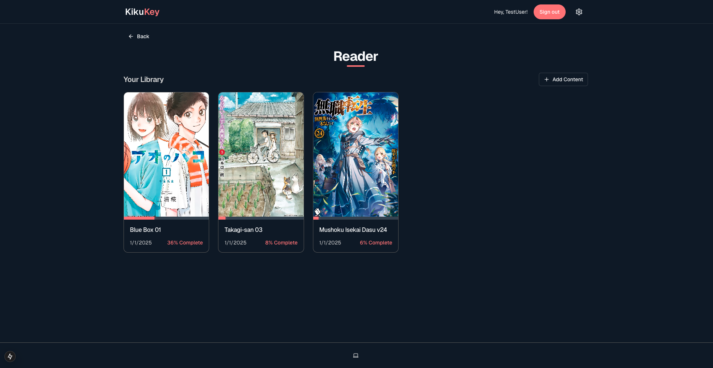
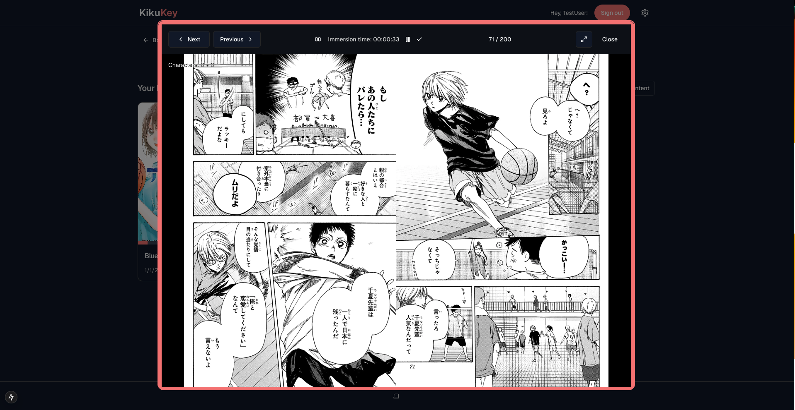
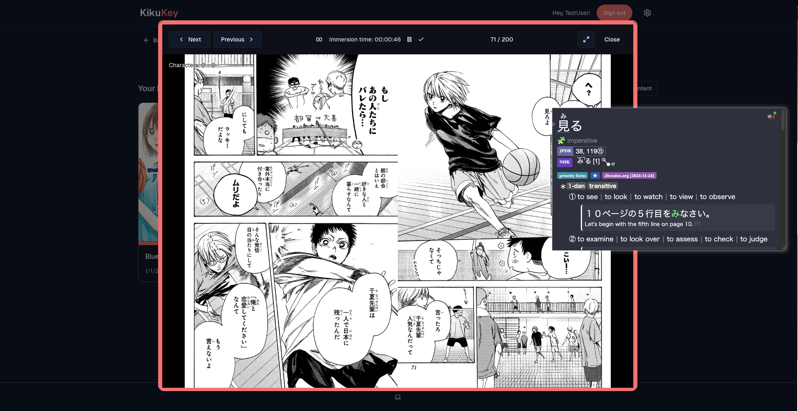
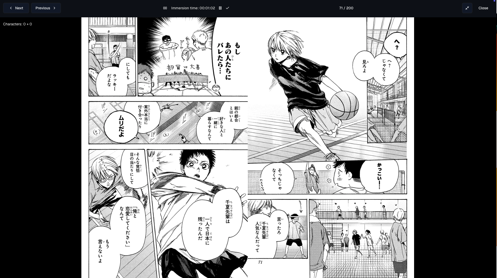
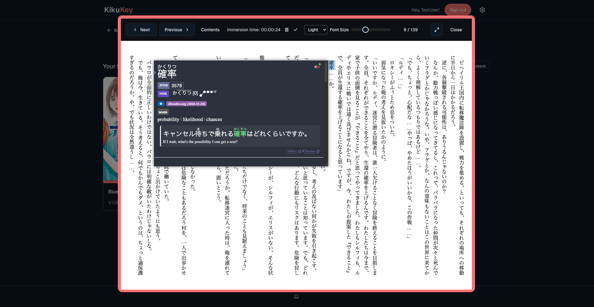

## Quizzes and Charts For Hiragana and Katakana

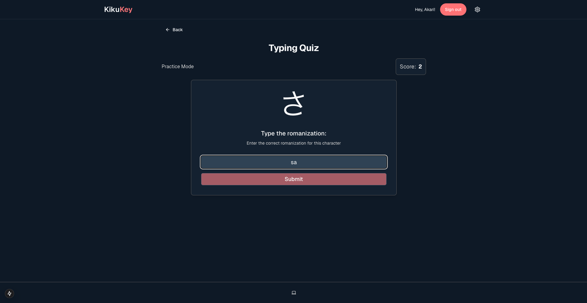
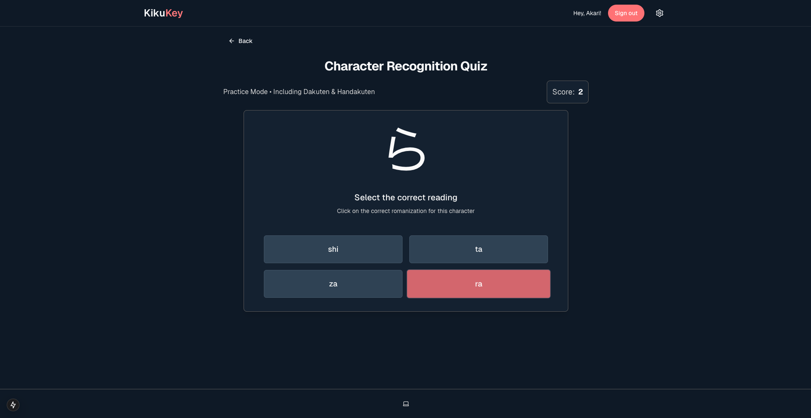
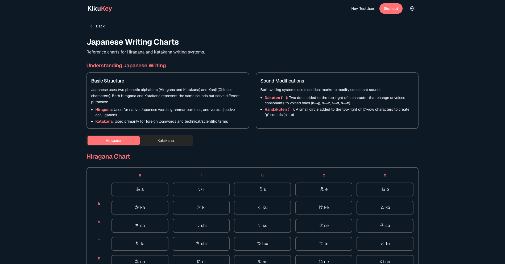

# Goals (now on dashboard)

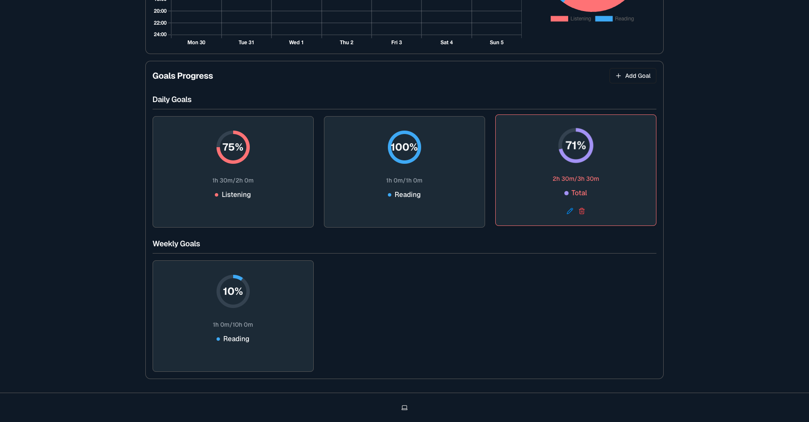